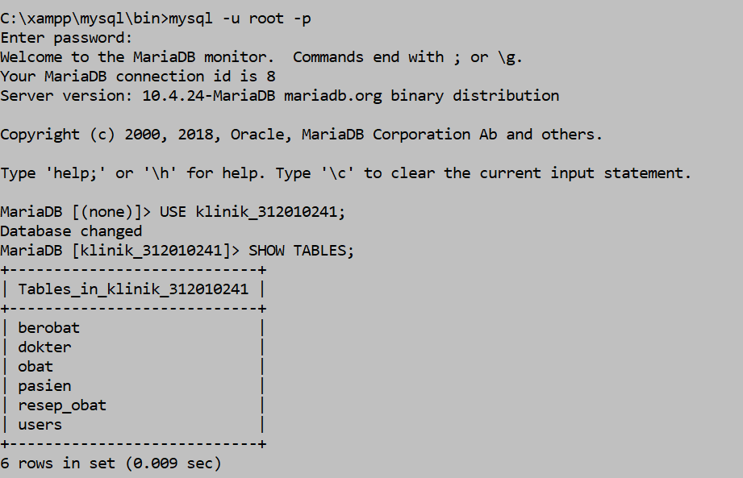
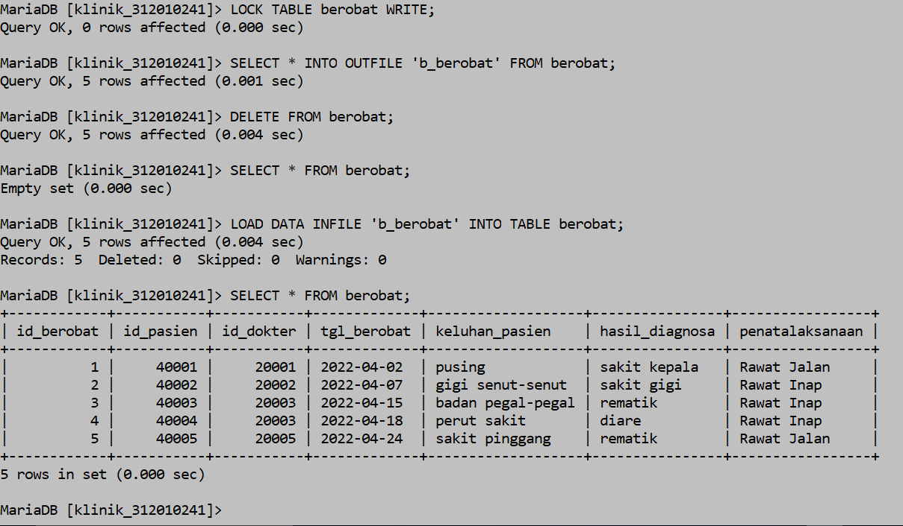
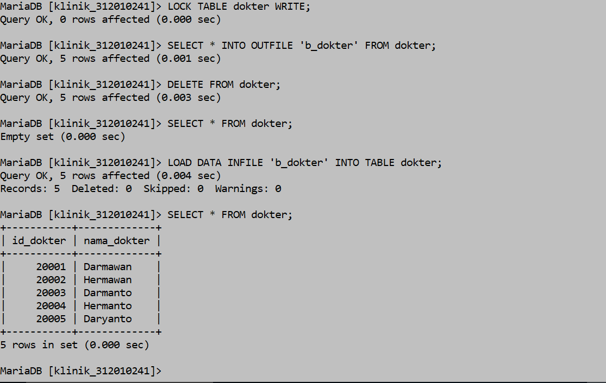
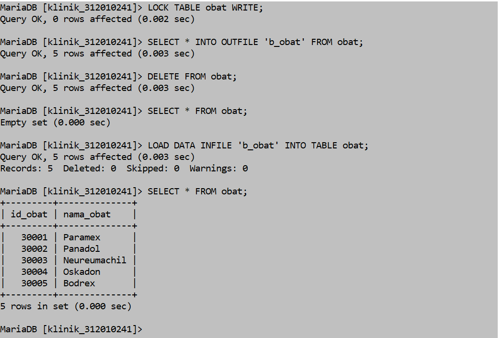
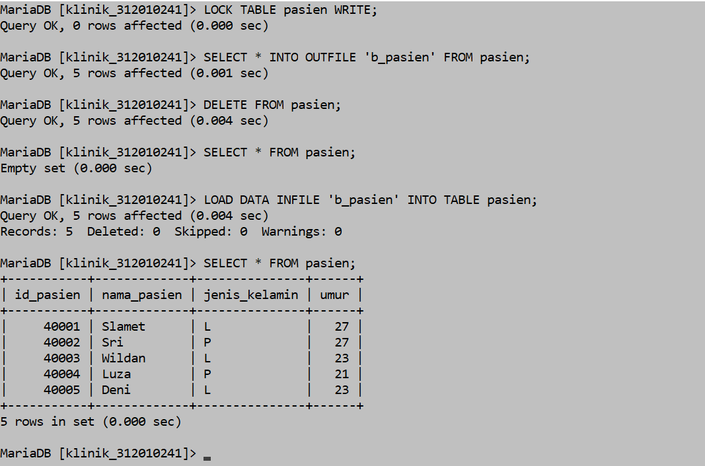
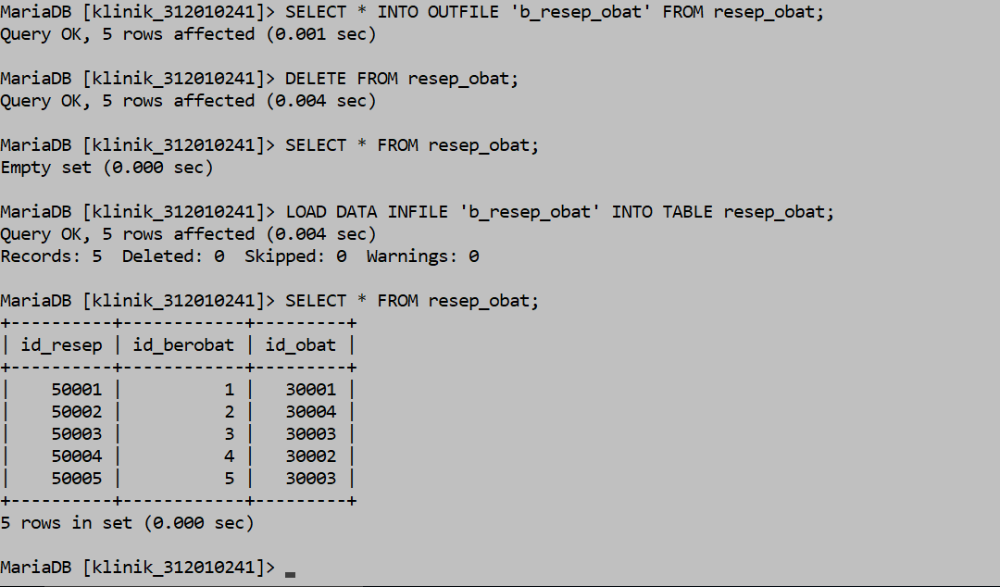
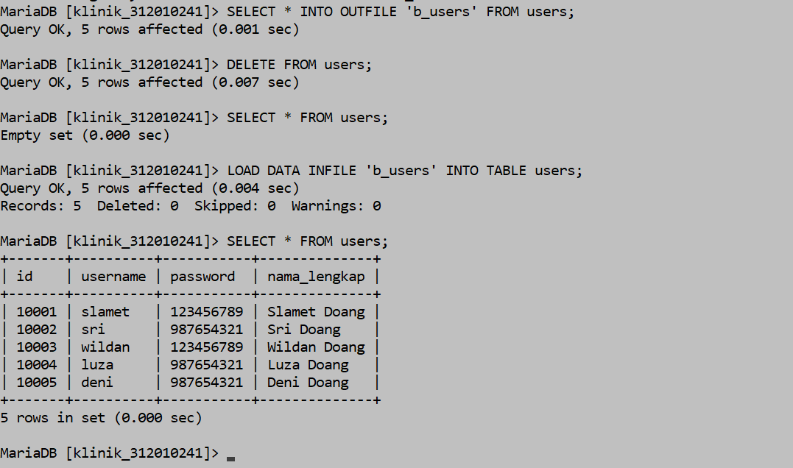
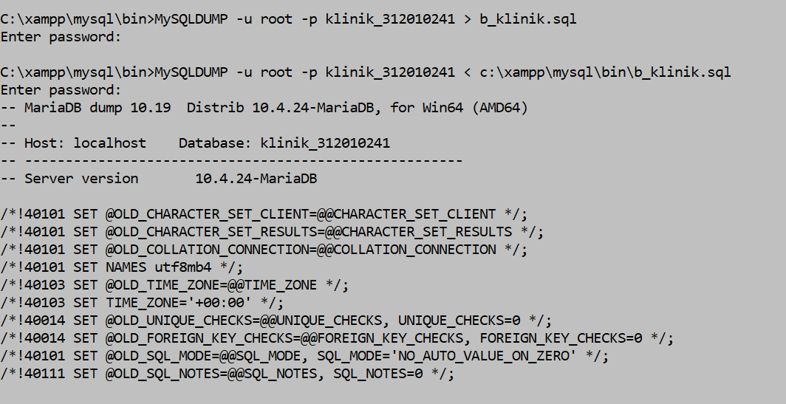

# SBD-TI20D2-TUGAS-6
Nama : Slamet  
NIM : 312010241  
Kelas : TI20D2  
# Daftar Tugas
1. Login Database  
2. Backup dan Recovery dengan SQL  
3. Backup dan Recovery dengan MySQLDUMP  
4. Menulis Script Cronjob  
# Backup dan Recovery Dengan SQL
  
  
  
  
  
  
  
  
# Backup dan Recovery dengan MySQLDUMP
  
# Script Cronjob
CRONTAB-E  
0 0 * * 0 MySQLDUMP –u root –p klinik_312010241 > b_klinik_312010241.sql
